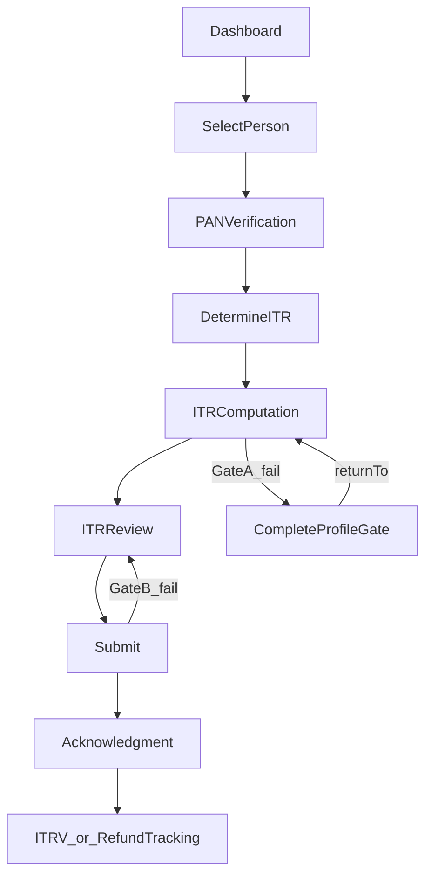

# Core Filing Stabilization (END_USER)

## Goal

Prove the existing end-to-end filing flow is **stable under real usage** (refreshes, direct links, partial profiles, retries), and close the remaining gaps so we can confidently plan the next product area.

## 1) Design-first checklist (source of truth)

Create a concise checklist doc that defines expected behavior for each step and edge case:

- **Happy path**: dashboard → select person → PAN verify → determine → computation (guided) → save → review → submit → acknowledgment → tracking.
- **Resume**: dashboard “Continue” deep-links using `draftId`; “Save & Exit” lands on `/dashboard`.
- **Gating**:
  - Gate A before computation: PAN verified + DOB.
  - Gate B at submit: address + bank details.
- **Refresh safety**: direct open of `/itr/computation?draftId=...` and `/acknowledgment/:filingId` works.
- **Readonly safety**: viewing submitted filings never becomes editable.
- **Error states**: network/500, missing draftId, missing filingId, missing profile.

File to add:

- `docs/ITR_CORE_STABILITY_CHECKLIST.md`

## 2) Make API response shapes consistent where they’re currently fragile

Unify any remaining endpoints/pages that assume inconsistent shapes (e.g., `successResponse` vs raw `{ filing: ... }`). This is required so refresh/direct navigation is reliable.

Likely touch points:

- [backend/src/routes/itr.js](backend/src/routes/itr.js) (filing endpoints)
- [frontend/src/services/api/itrService.js](frontend/src/services/api/itrService.js)
- Tracking pages and acknowledgment page.

## 3) Server-side enforcement of “Gate B” (don’t rely on UI only)

Add submit-time validation in the backend so submission can’t proceed if required fields are missing.

- Enforce bank details are present in the draft payload.
- Enforce address is present (from `user_profiles` or canonical store) if that is the chosen source.
- Return a structured `validationErrorResponse` with missing fields so the frontend can show “Fix now”.

Files:

- [backend/src/controllers/ITRController.js](backend/src/controllers/ITRController.js) (`submitITR`)
- (if needed) [backend/src/models/UserProfile.js](backend/src/models/UserProfile.js)

## 4) Navigation + returnTo hardening

Ensure return-to flows always bring users back to where they were:

- PAN verification: supports `?returnTo=` and preserves prior location state.
- Complete profile gate: uses `returnTo` and restores state.
- Profile/address fix: add a safe return link back to review/submit.

Files:

- [frontend/src/pages/ITR/PANVerification.js](frontend/src/pages/ITR/PANVerification.js)
- [frontend/src/pages/Onboarding/CompleteProfileGate.js](frontend/src/pages/Onboarding/CompleteProfileGate.js)
- [frontend/src/pages/ITR/ITRReview.js](frontend/src/pages/ITR/ITRReview.js)
- [frontend/src/pages/User/ProfileSettings.js](frontend/src/pages/User/ProfileSettings.js) and/or [frontend/src/pages/User/UserProfile.js](frontend/src/pages/User/UserProfile.js)

## 5) Verification pass (manual + lightweight instrumentation)

- Run the checklist end-to-end in the browser for:
  - New user (no PAN/DOB) → gate → verify → proceed.
  - Existing user (PAN verified) → direct resume.
  - Save, refresh, resume, submit, and track.
- Add or adjust a minimal set of `trackEvent` calls only if we find blind spots while debugging.

## Acceptance criteria

- No build/lint errors.
- All pages load correctly on refresh/direct navigation.
- Gate A blocks computation only for END_USER in editable mode.
- Submission is blocked both in UI **and** on backend when Gate B fails, with actionable error details.
- Dashboard resume reliably opens computation with the right draft.