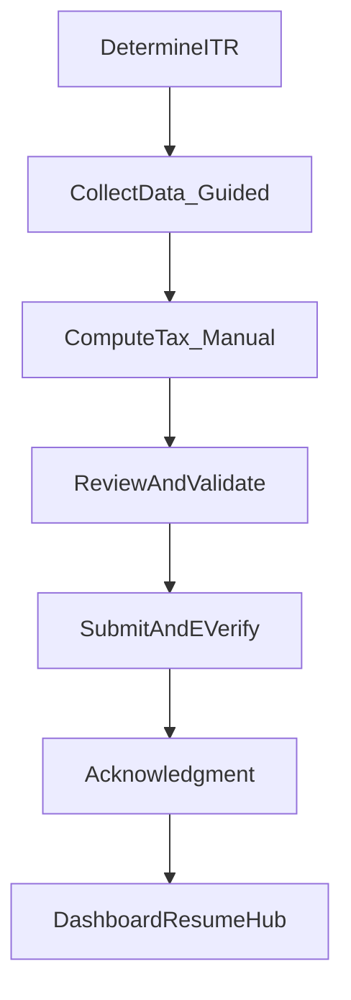

# Remaining Steps (Core → Outward) based on itr_userflow_redesign_08e126be

## What we already have (core milestones)

Using `.cursor/plans/itr_userflow_redesign_08e126be.plan.md` as the base:

- **DetermineITR convergence**: `/itr/determine` is canonical; legacy routes redirect.
- **Compute nucleus**: `/itr/computation` is the single working surface.
- **Review/Submit/Ack**: `/itr/review` exists; submission uses `POST /api/itr/drafts/:draftId/submit`; acknowledgment uses `/acknowledgment/:filingId`.

This matches the core state machine in the base doc.

## Remaining steps (in core-first order)

### Step 1 — Finish “Collect Data (guided)” inside `/itr/computation` (still core)

Design-first docs already started via `docs/ITR_COLLECT_DATA_GUIDED_SPEC.md`. Remaining implementation is to make the guided experience feel like a single CA-led checklist:

- **Next/Prev navigation**: add a primary “Next: …” CTA (soft-gated) and optional “Back” inside computation.
- **Section completion**: use `frontend/src/pages/ITR/sectionFlow.js` to compute required-missing counts consistently.
- **Sidebar alignment**: show ordered sections and “Incomplete” counts; keep free navigation (soft gating).
- **No compute spam**: keep compute manual only.

Primary files:

- [`frontend/src/pages/ITR/ITRComputation.js`](frontend/src/pages/ITR/ITRComputation.js)
- [`frontend/src/pages/ITR/sectionFlow.js`](frontend/src/pages/ITR/sectionFlow.js)
- [`frontend/src/components/ITR/ITRComputationHeader.js`](frontend/src/components/ITR/ITRComputationHeader.js)
- [`frontend/src/components/ITR/ComputationSidebar.js`](frontend/src/components/ITR/ComputationSidebar.js)

### Step 2 — Dashboard Resume Hub (post-ack “what next”)

Make `/dashboard` the true resume hub with one obvious CTA:

- **Continue filing**: if there is a resumable draft/filing, show “Continue” and deep-link into `/itr/computation` with `draftId`/`filingId`.
- **Track filing**: for submitted filings, show “View acknowledgment” and “E-verify / ITR-V status”.
- **Start new filing**: always available.

Primary files:

- [`frontend/src/pages/Dashboard/UserDashboard.js`](frontend/src/pages/Dashboard/UserDashboard.js)
- [`frontend/src/hooks/useUserDashboard.js`](frontend/src/hooks/useUserDashboard.js)
- Backend stats already come from `GET /api/users/dashboard`.

### Step 3 — Tracking slice (lightweight, not a new product)

Keep tracking simple:

- From dashboard: link to
  - `/acknowledgment/:filingId`
  - `/itr/itrv-tracking`
  - `/itr/refund-tracking`
- Ensure filing status transitions are consistently displayed.

Primary files:

- [`frontend/src/pages/Acknowledgment.js`](frontend/src/pages/Acknowledgment.js)
- [`frontend/src/pages/ITR/ITRVTracking.js`](frontend/src/pages/ITR/ITRVTracking.js) (existing)
- [`frontend/src/pages/ITR/RefundTracking.js`](frontend/src/pages/ITR/RefundTracking.js) (existing)

### Step 4 — Targeted DB audit checkpoints (only what we touch)

Do not run a broad platform audit every time; keep it scoped:

- **Collect Data / Draft persistence**: verify `itr_drafts.data` JSONB shape, defaults, and update paths (`POST/PUT /api/itr/drafts`).
- **Submit/Ack**: verify `itr_filings` defaults and status transitions; ack PDF endpoint; itrv endpoints.
- Generate/update a short report file per slice (one page) under `docs/` so changes stay documented.

### Step 5 — UI/UX matching (scoped)

After each step above:

- Ensure new/changed UI uses design tokens and shared components.
- Avoid repo-wide churn; only touch files changed for the step.

### Step 6 — Work outward later (not now)

Defer until core is stable:

- Onboarding “just enough” (profile completion gating)
- CA context switching + review queue
- Super Admin tooling

## Acceptance criteria (for the next milestone)

- `/itr/computation` feels guided: “Next” works, soft gating works, users are never stuck.
- `/dashboard` clearly shows one primary CTA: Continue / Track / Start.
- Submission/ack flows remain stable and canonical routes are used.
- Each step has a small doc + a scoped DB audit note.