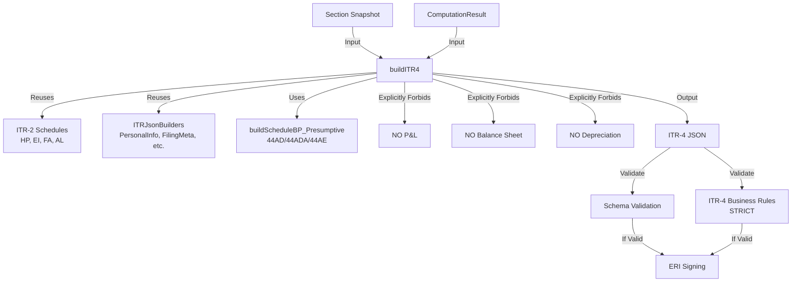

# ITR-4 JSON Generation Pipeline

## Objective

Extend the ITR-2 JSON generation pipeline to support ITR-4 (Sugam) by adding:

- Schedule BP (Presumptive) with Section 44AD/44ADA/44AE
- **NO P&L Account**
- **NO Balance Sheet**
- **NO Depreciation schedules**

ITR-4 = ITR-2 + Presumptive Business Income (without accounting truth)

## Architecture Overview

## Implementation Steps

### Step 1: Create ITR-4 Schedule Builders Module

**File:** `backend/src/services/business/ITR4ScheduleBuilders.js` (new)

**Purpose:** Builders for ITR-4 specific presumptive schedules.

**Builders:**

1. **`buildScheduleBP_Presumptive(sectionSnapshot, computationResult)`**

   - Maps `sectionSnapshot.income.presumptiveBusiness` and `presumptiveProfessional` to Schedule BP
   - Handles three sections:
     - **Section 44AD**: Business presumptive (8% of gross receipts, 6% for digital)
     - **Section 44ADA**: Profession presumptive (50% of gross receipts)
     - **Section 44AE**: Goods carriage presumptive (per vehicle rates)
   - Includes:
     - Nature of business/profession
     - Gross receipts/turnover
     - Presumptive income declared
     - Section code
     - Cash/non-cash breakup (if applicable)
   - Returns: `{ NatOfBus44AD: {}, PresumpIncDtls: {}, TotPresumpBusInc: string }`
   - **Critical:** No expenses, no depreciation, income is directly taxable

**Rules:**

- All builders are pure functions (no side effects)
- All builders use ComputationResult for totals (no recomputation)
- **NO P&L, NO Balance Sheet, NO Depreciation**
- All amounts formatted as strings with 2 decimal places

### Step 2: Create ITR-4 JSON Builder

**File:** `backend/src/services/business/ITR4JsonBuilder.js` (new)

**Purpose:** Main builder that assembles complete ITR-4 JSON.

**Structure:**

- Reuses ITR-2 schedules (HP, EI, FA, AL) via `ITR2ScheduleBuilders`
- Reuses common builders (PersonalInfo, FilingMeta, etc.) via `ITRJsonBuilders`
- Uses ITR-4 specific builder for presumptive Schedule BP
- Assembles complete `Form_ITR4` structure
- **Explicitly excludes:** P&L, Balance Sheet, Depreciation, Schedule CG (not allowed in ITR-4)

**Key Method:**

- `async buildITR4(sectionSnapshot, computationResult, assessmentYear, user, aggregatedSalary, filingId)`
  - Returns complete ITR-4 JSON
  - Validates no P&L/BS/DEP present

### Step 3: Extend Business Validator

**File:** `backend/src/services/business/ITRBusinessValidator.js` (update)

**Add ITR-4 validation methods:**

1. **`validateITR4BusinessRules(itr4Json, sectionSnapshot, computationResult)`**

   - Main validation method
   - Ensures presumptive flag = true
   - Ensures Schedule BP present (presumptive)
   - Ensures P&L **must NOT exist**
   - Ensures Balance Sheet **must NOT exist**
   - Ensures Depreciation **must NOT exist**
   - Validates turnover limits (₹20L for business, ₹5L for profession)
   - Validates section codes (44AD/44ADA/44AE)

2. **`validateITR4ScheduleBP(itr4Json, sectionSnapshot, result)`**

   - Validates presumptive Schedule BP structure
   - Validates section codes
   - Validates turnover limits
   - Ensures no expenses/depreciation

3. **`validateITR4NoPLBS(itr4Json, sectionSnapshot, result)`**

   - **Critical:** Ensures P&L does NOT exist
   - **Critical:** Ensures Balance Sheet does NOT exist
   - **Critical:** Ensures Depreciation does NOT exist
   - Fails fast if any accounting schedules present

4. **`validateITR4NoRegularBusiness(itr4Json, sectionSnapshot, result)`**

   - Ensures no regular business income (that's ITR-3)
   - Ensures no P&L data in snapshot

### Step 4: Integration with ITRController

**File:** `backend/src/controllers/ITRController.js` (update)

**Changes:**

1. Add `generateITR4JsonWithPipeline()` method

   - Similar to ITR-1/ITR-2/ITR-3 pipeline methods
   - Uses ITR4JsonBuilder
   - Performs schema and business validation

2. Update `exportITRJson()` method

   - Add ITR-4 handling using new pipeline
   - Fallback to old method on error

3. Update `submitITR()` method

   - Add ITR-4 handling using new pipeline
   - Strict validation before submission

## Validation Rules (Critical)

- Presumptive flag = true (enforced by Domain Core)
- Schedule BP present (presumptive format)
- P&L **must NOT exist** (error if present)
- Balance Sheet **must NOT exist** (error if present)
- Depreciation **must NOT exist** (error if present)
- Turnover limits respected:
  - Business: max ₹20 lakh
  - Profession: max ₹5 lakh
- Section codes valid (44AD/44ADA/44AE)
- No regular business income

## Common ITR-4 ERI Rejection Causes

- P&L accidentally included
- Balance Sheet accidentally included
- Wrong presumptive section
- Turnover limit exceeded
- Zero-filled BP nodes
- Regular business income present

## Success Criteria

- ITR-4 JSON generated correctly
- Presumptive Schedule BP with correct section codes
- No P&L/BS/DEP schedules in output
- Strict validation blocks invalid filings
- Schema validation passes
- Business validation passes
- Integration with export and submit endpoints