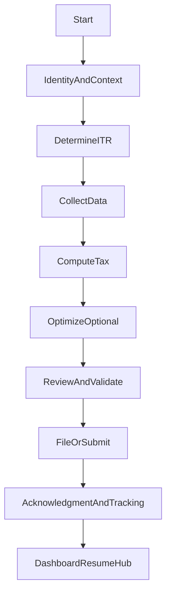

# Bottom-up Userflow Redesign (StartAtCompute, WorkOutward)

## North-star framing (what “simple” means)

- **One canonical artifact**: a filing always has a stable `filingId` and a latest `draftId` (resume anytime).
- **Progressive disclosure**: ask only what’s needed *for the chosen ITR path* and *current section*; defer advanced forms until the user’s answers require them.
- **Two personas, one core**: END_USER self-serve and CA-assisted share the same **core engine + draft model**, but differ in entry points, context switching, and review/approval steps.

## The “absolute necessary” journey (shared core)

This is the invariant loop that every ITR type and persona must pass through:

### Step definitions (minimum contract)

- **IdentityAndContext**
  - END_USER: self vs family member selection.
  - CA: select client (and optionally AY) before entering computation.
- **DetermineITR**
  - A single, explainable decision based on income sources + exclusions.
- **CollectData**
  - Prefer **prefill/import** first; fall back to manual. Never block progress.
- **ComputeTax**
  - Deterministic compute from draft data (manual trigger; stable results).
- **ReviewAndValidate**
  - Surface only blocking issues; everything else is “warning + fix later”.
- **FileOrSubmit**
  - Minimal choices: verification method → submit.
- **AcknowledgmentAndTracking**
  - One page that confirms filing and next actions.
- **DashboardResumeHub**
  - One obvious “Continue filing” CTA + status.

## Mapping to the current platform (what exists today)

- **Computation core** lives in [`frontend/src/pages/ITR/ITRComputation.js`](frontend/src/pages/ITR/ITRComputation.js) and [`backend/src/controllers/ITRController.js`](backend/src/controllers/ITRController.js).
- **Draft model + ITR routes** in [`backend/src/routes/itr.js`](backend/src/routes/itr.js).
- **Role-based landing** is `/home` → [`frontend/src/pages/HomeRedirect.js`](frontend/src/pages/HomeRedirect.js).
- **End-user resume hub** is [`frontend/src/pages/Dashboard/UserDashboard.js`](frontend/src/pages/Dashboard/UserDashboard.js).
- **Auth entry** and account security are in [`backend/src/routes/auth.js`](backend/src/routes/auth.js) and frontend auth context [`frontend/src/contexts/AuthContext.js`](frontend/src/contexts/AuthContext.js).

## ITR-specific “necessary steps” (differences only)

### ITR-1 / ITR-2 (typical individual)

- **DetermineITR**: salary/interest/other/capital gains; no business.
- **CollectData**: Form-16 upload, AIS/TIS, bank pulls (optional), manual income.
- **Compute/Review**: deductions + taxes paid + refund/due.

### ITR-4 (presumptive)

- **DetermineITR**: confirm presumptive eligibility early.
- **CollectData**: basic turnover/profit method + GSTIN if needed.

### ITR-3 (business/profession)

- **DetermineITR**: trigger as soon as user indicates business/profession.
- **CollectData (must-have)**:
  - business profile (nature, GST, books/audit)
  - P&L + Balance Sheet (only if required)
  - capital accounts/partners/director flags when applicable
- **UX rule**: ITR-3 should feel like “add 2–3 modules” to the same computation page, not a completely new product.

## Bottom-up execution plan (start from compute, then work outward)

### Phase A — Perfect the compute nucleus (short-term stability + long-term correctness)

- **A1. Define the contract for draft→compute**
  - Input: `draftId`/`filingId` + normalized `formData`.
  - Output: tax summary + explanations + regime comparison.
  - Files to anchor: [`frontend/src/pages/ITR/ITRComputation.js`](frontend/src/pages/ITR/ITRComputation.js), [`backend/src/controllers/ITRController.js`](backend/src/controllers/ITRController.js).
  - **Short-term benefit**: no surprises, fewer UI regressions.
  - **Long-term benefit**: engine becomes reusable for CA review and automation.

- **A2. Freeze “compute triggers” and compute states**
  - Manual compute only; “stale” indicator when inputs change.
  - **Short-term**: removes request spam and UI instability.
  - **Long-term**: enables caching + deterministic audits.

- **A3. Validation layers**
  - Section-level validation (inline) + filing-level validation (submit gate).
  - **Short-term**: fewer dead-ends late in the journey.
  - **Long-term**: supports CA review queue + automation.

### Phase B — Build outward: collection modules and step gating

- **B1. Data sources first, manual second**
  - The user always chooses a source: upload/import/manual.
  - Reuse existing surfaces: [`frontend/src/components/ITR/DataSourceSelector.js`](frontend/src/components/ITR/DataSourceSelector.js), [`frontend/src/pages/ITR/DocumentUploadHub.js`](frontend/src/pages/ITR/DocumentUploadHub.js).
  - **Short-term**: reduces overwhelm.
  - **Long-term**: improves accuracy via prefill.

- **B2. Progressive disclosure per ITR**
  - ITR-3 modules only appear after the “business/profession” switch is confirmed.
  - **Short-term**: avoids showing balance sheet to an ITR-1 user.
  - **Long-term**: makes the product scalable across many tax situations.

### Phase C — File and post-file (ack + tracking)

- **C1. Review is a single, structured checklist**
  - “Must fix” vs “Recommended”.
- **C2. Submit + E-verify**
  - One choice point; keep it linear.
- **C3. Acknowledgment page**
  - Clear “what happens next”, and link to tracking.

### Phase D — Work outward to login/onboarding (reduce friction, keep security)

- **D1. Role-based home is the canonical entry**
  - `/home` stays as the universal post-auth route (already backed by [`frontend/src/pages/HomeRedirect.js`](frontend/src/pages/HomeRedirect.js)).
- **D2. Onboarding is just enough**
  - Collect only what unlocks drafting: full name + PAN + AY intent; defer everything else.
- **D3. CA context switching**
  - CA dashboard → client selection → same computation core.

## Deliverables (what you’ll get from this exercise)

- **Journey spec**: one page per ITR type (1/2/3/4) with required steps and branch conditions.
- **Screen map**: current routes/components mapped to each step.
- **Gap list**: what’s missing/duplicated and which step it blocks.
- **Metrics**: per-step drop-off, time-to-first-compute, time-to-submit.

## Key decision points we will lock early (to avoid churn)

- **What is the nucleus**: draft model + compute contract is the product core.
- **What is “done” for a step**: each step has pass/fail criteria and logs.
- **Where users land**:
  - After auth: `/home` → role redirect.
  - After Save & Exit: resume hub (`/dashboard` for END_USER; `/home` for others).