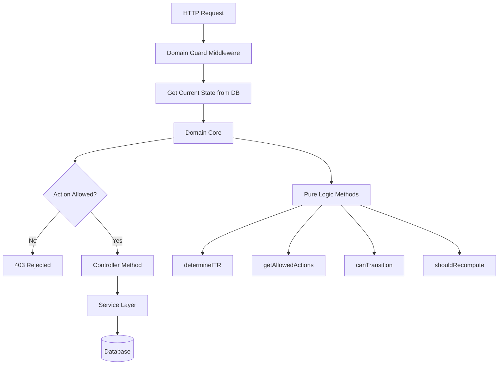

# Phase 1: Make Domain Core Authoritative

## Objective

Turn Domain Core from placeholder into gatekeeper that prevents violations and stabilizes behavior, without breaking the app or refactoring controllers.

## Step 1: Implement Core Domain Core Methods (Pure Logic Only)

**File:** `backend/src/domain/ITRDomainCore.js`

Implement these 4 methods with **pure logic only** (no DB, no API, no side effects):

### 1.1 `determineITR(signals)`

- **Input:** User data signals (income sources, capital gains, business income, etc.)
- **Output:** `{ recommendedITR: 'ITR-1'|'ITR-2'|'ITR-3'|'ITR-4', confidence: number, reason: string }`
- **Logic:** Use rules from `frontend/src/services/ITRAutoDetector.js` but as pure function
- **Note:** This becomes the single source of truth for ITR determination

### 1.2 `getAllowedActions(state, actor)`

- **Input:** Current domain state, actor (user role, permissions)
- **Output:** Array of allowed action strings
- **Logic:** 
  - Get base actions from `STATE_ALLOWED_ACTIONS[state]`
  - Filter by actor role/permissions (RBAC integration point)
  - Return filtered actions
- **Note:** This replaces frontend/controller decision logic

### 1.3 `canTransition(fromState, toState)`

- **Input:** Current state, target state
- **Output:** Boolean
- **Logic:** Check `VALID_STATE_TRANSITIONS[fromState].includes(toState)`
- **Note:** Already partially implemented, complete it

### 1.4 `shouldRecompute(prevSnapshot, newSnapshot)`

- **Input:** Previous data snapshot, new data snapshot
- **Output:** Boolean
- **Logic:** Compare key fields that affect tax computation:
  - Income amounts
  - Deduction amounts
  - Tax regime
  - ITR type
- **Note:** Determines if recomputation is needed after data changes

**Implementation Notes:**

- Keep all methods synchronous (no async/await)
- No database queries
- No external API calls
- Pure functions only
- Use existing `states.js` constants

## Step 2: Create Domain Guard Middleware

**File:** `backend/src/middleware/domainGuard.js` (new)

### 2.1 Middleware Structure

```javascript
const domainGuard = (action, options = {}) => {
  return async (req, res, next) => {
    // 1. Extract filingId from req.params or req.body
    // 2. Get current state (map from ITRFiling.status to domain state)
    // 3. Check if action is allowed using DomainCore.getAllowedActions()
    // 4. If not allowed → reject with 403
    // 5. If allowed → attach action to req.domainAction and continue
  };
};
```

### 2.2 Action Mapping

Map HTTP methods + routes to domain actions:

- `POST /drafts` → `determine_itr_type` or `collect_initial_data`
- `PUT /drafts/:draftId` → `edit_data` or `collect_data`
- `POST /compute-tax` → `compute_tax`
- `POST /submit` → `file_itr`
- `PUT /lock` → `lock_filing`
- `PUT /itr-type` → `change_itr_type`

### 2.3 State Mapping

Create helper function to map `ITRFiling.status` to domain state:

- `'draft'` → `ITR_DETERMINED` or `DATA_COLLECTED` (infer from step/data)
- `'submitted'` → `FILED`
- `'acknowledged'` → `ACKNOWLEDGED`
- `'processed'` → `COMPLETED`

### 2.4 Integration Points

Apply middleware to routes in `backend/src/routes/itr.js`:

- Guard mutation routes (PUT, POST for updates)
- Guard computation routes
- Guard submission routes
- Guard ITR switching routes

**Note:** Do NOT refactor controllers - just guard them.

## Step 3: Enforce LOCKED State Globally

### 3.1 Domain Guard Check

In `domainGuard.js`, add explicit LOCKED check:

```javascript
if (currentState === ITR_DOMAIN_STATES.LOCKED) {
  // Only allow: file_itr, unlock_filing (admin), read operations
  if (!['file_itr', 'unlock_filing', 'read'].includes(action)) {
    return res.status(403).json({
      success: false,
      message: 'Filing is locked. No mutations allowed.',
      state: currentState
    });
  }
}
```

### 3.2 Defensive Service Checks

Add defensive checks in write services (as backup):

**Files to update:**

- `backend/src/services/business/ForeignAssetsService.js` - Check state before mutations
- `backend/src/services/business/BalanceSheetService.js` - Check state before mutations
- `backend/src/services/business/AuditInformationService.js` - Check state before mutations

**Pattern:**

```javascript
// At start of mutation method
const currentState = await getDomainState(filingId);
if (currentState === ITR_DOMAIN_STATES.LOCKED) {
  throw new AppError('Filing is locked', 403);
}
```

### 3.3 Model Method Protection

Update `ITRDraft.prototype.updateData()` in `backend/src/models/ITRDraft.js`:

- Add state check before allowing updates
- Throw error if state is LOCKED

**Note:** This is defensive - Domain Guard is primary protection.

## Step 4: Centralize ITR Switching

### 4.1 Route ITR Changes Through Domain Core

**File:** `backend/src/controllers/ITRController.js`

**Method:** `createDraft()` and any ITR type change logic

**Changes:**

- Remove direct ITR type assignment
- Call `DomainCore.determineITR()` for ITR determination
- If ITR type changes in existing filing:
  - Call `DomainCore.changeITRType()` (to be implemented in Phase 2)
  - For now, validate through Domain Core and reject if state doesn't allow

### 4.2 Frontend ITR Switching

**File:** `frontend/src/components/ITR/ITRToggle.js`

**Changes:**

- Remove direct ITR type change
- Call backend API endpoint that uses Domain Core
- Backend validates through Domain Guard

**New Backend Route:** `PUT /api/itr/filings/:filingId/itr-type`

- Protected by Domain Guard with `change_itr_type` action
- Validates state allows ITR change
- Returns error if not allowed

### 4.3 ITR Change Effects

When ITR type changes:

- Auto-rollback to `ITR_DETERMINED` state (Phase 2)
- Invalidate computation (Phase 2)
- Emit notice to user (Phase 2)

**For Phase 1:** Just block invalid ITR changes.

## Step 5: Do NOT Touch (Explicitly)

**Do NOT refactor:**

- `TaxComputationEngine` - Keep as-is
- `ValidationEngine` - Keep as-is
- Frontend flows - Keep as-is
- Database schema - Keep as-is
- Finance logic - Keep as-is

These will be addressed in later phases.

## Implementation Order

1. **Step 1** - Implement 4 core Domain Core methods (pure logic)
2. **Step 2** - Create Domain Guard middleware
3. **Step 3** - Enforce LOCKED state (in guard + defensive checks)
4. **Step 4** - Centralize ITR switching (route through Domain Core)
5. **Testing** - Verify app still works, violations are blocked

## Success Criteria

When Phase 1 is complete:

- ✅ No data mutation after LOCKED (blocked by guard)
- ✅ No ITR switch outside Domain Core (routed through guard)
- ✅ Controllers no longer decide legality (guard decides)
- ✅ Domain Core blocks invalid actions (guard enforces)
- ✅ App still works (no breaking changes)

## Files to Create/Modify

**New Files:**

- `backend/src/middleware/domainGuard.js`

**Modify Files:**

- `backend/src/domain/ITRDomainCore.js` - Implement 4 core methods
- `backend/src/routes/itr.js` - Add Domain Guard middleware
- `backend/src/models/ITRDraft.js` - Add defensive LOCKED check
- `backend/src/controllers/ITRController.js` - Route ITR changes through Domain Core
- `frontend/src/components/ITR/ITRToggle.js` - Call backend for ITR changes

**Optional Defensive Checks:**

- `backend/src/services/business/ForeignAssetsService.js`
- `backend/src/services/business/BalanceSheetService.js`
- `backend/src/services/business/AuditInformationService.js`

## Architecture Diagram



## Notes

- This is **platform stabilization**, not cleanup
- Controllers remain unchanged (just guarded)
- Services remain unchanged (just defensive checks)
- Frontend remains unchanged (just ITR switching routed)
- No database changes
- No breaking API changes