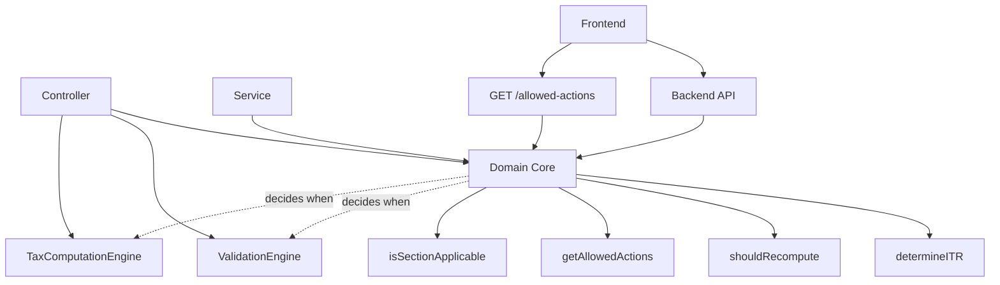

# Phase 2: Move Intelligence into Domain Core

## Objective

Gradually remove duplicated decision-making from services/controllers and centralize it into Domain Core, without touching UI flows or DB schema. This reduces bugs, reduces code, increases confidence, and makes future features cheaper.

## Step 2.1: Centralize ITR Eligibility Logic Fully

### Current State

Found 23+ ITR type checks in `backend/src/controllers/ITRController.js`:

- Lines 1029, 1059: ITR-3/ITR-4 specific validations
- Lines 2823, 2871, 2918, 2966: Schedule FA checks (ITR-2/3 only)
- Lines 3558, 3601, 3643, 3690: Foreign assets checks (ITR-2 only)
- Lines 4348, 4390, 4432, 4474, 4521, 4568, 4619, 4712: Balance sheet/audit checks (ITR-3 only)
- Line 5282: Switch statement for ITR-specific export formatting
- Multiple ITR type checks in services (AIRecommendationService, TaxComputationEngine)

### Action

Replace all ITR type conditional logic with Domain Core calls:

**File:** `backend/src/controllers/ITRController.js`

1. **ITR-specific validation blocks** (lines 1029-1075):

                                                                                                                                                                                                                                                                                                                                                                                                                                                                                                                                                                                                                                                                                                                                                                                                - Replace `if (itrType === 'ITR-3')` checks with Domain Core eligibility check
                                                                                                                                                                                                                                                                                                                                                                                                                                                                                                                                                                                                                                                                                                                                                                                                - Replace `if (itrType === 'ITR-4')` checks with Domain Core eligibility check
                                                                                                                                                                                                                                                                                                                                                                                                                                                                                                                                                                                                                                                                                                                                                                                                - Use `DomainCore.determineITR(formData)` to validate ITR type appropriateness

2. **ITR-specific section visibility** (lines 2823-4712):

                                                                                                                                                                                                                                                                                                                                                                                                                                                                                                                                                                                                                                                                                                                                                                                                - Replace `if (itrType !== 'ITR-2' && itrType !== 'ITR2' && ...)` checks
                                                                                                                                                                                                                                                                                                                                                                                                                                                                                                                                                                                                                                                                                                                                                                                                - Use Domain Core to determine if section is applicable for current ITR type
                                                                                                                                                                                                                                                                                                                                                                                                                                                                                                                                                                                                                                                                                                                                                                                                - Create helper: `DomainCore.isSectionApplicable(itrType, sectionId)`

3. **ITR-specific export formatting** (line 5282):

                                                                                                                                                                                                                                                                                                                                                                                                                                                                                                                                                                                                                                                                                                                                                                                                - Replace `switch (itrType)` with Domain Core-based formatting rules
                                                                                                                                                                                                                                                                                                                                                                                                                                                                                                                                                                                                                                                                                                                                                                                                - Use Domain Core to determine required fields per ITR type

**File:** `backend/src/services/business/AIRecommendationService.js`

- Replace ITR type checks (lines 107, 190, 204, 218) with Domain Core calls
- Use `DomainCore.determineITR(formData)` to validate recommendations

**File:** `backend/src/services/core/TaxComputationEngine.js`

- Replace ITR type checks (lines 177, 196) with Domain Core-based logic
- Use Domain Core to determine data structure expectations per ITR type

### Implementation

**Add to Domain Core:**

```javascript
// backend/src/domain/ITRDomainCore.js

/**
 * Check if a section is applicable for given ITR type
 * PURE FUNCTION: ITR-only, no state inspection, no validation logic
 * @param {string} itrType - ITR type
 * @param {string} sectionId - Section identifier
 * @returns {boolean} Whether section is possible in this ITR type
 */
isSectionApplicable(itrType, sectionId) {
  // Normalize ITR type
  const normalizedITR = itrType?.replace('-', '').toUpperCase() || '';
  const itrKey = normalizedITR.startsWith('ITR') ? `ITR-${normalizedITR.slice(3)}` : itrType;

  const sectionMap = {
    'ITR-1': ['personalInfo', 'income', 'deductions', 'taxesPaid', 'bankDetails'],
    'ITR-2': ['personalInfo', 'income', 'deductions', 'taxesPaid', 'bankDetails', 'scheduleFA', 'foreignIncome'],
    'ITR-3': ['personalInfo', 'income', 'deductions', 'taxesPaid', 'bankDetails', 'balanceSheet', 'auditInfo', 'scheduleFA'],
    'ITR-4': ['personalInfo', 'income', 'deductions', 'taxesPaid', 'bankDetails', 'presumptiveIncome', 'goodsCarriage'],
  };
  return (sectionMap[itrKey] || []).includes(sectionId);
}

/**
 * Get required fields for ITR type
 * PURE FUNCTION: ITR-only, no state inspection, no validation logic
 * @param {string} itrType - ITR type
 * @returns {Array<string>} Array of required field paths
 */
getRequiredFieldsForITR(itrType) {
  // Normalize ITR type
  const normalizedITR = itrType?.replace('-', '').toUpperCase() || '';
  const itrKey = normalizedITR.startsWith('ITR') ? `ITR-${normalizedITR.slice(3)}` : itrType;

  const fieldMap = {
    'ITR-1': ['personalInfo.pan', 'personalInfo.name', 'income.salary'],
    'ITR-2': ['personalInfo.pan', 'personalInfo.name', 'income.salary'],
    'ITR-3': ['personalInfo.pan', 'personalInfo.name', 'income.businessIncome', 'income.professionalIncome'],
    'ITR-4': ['personalInfo.pan', 'personalInfo.name', 'income.presumptiveBusiness', 'income.presumptiveProfessional'],
  };
  return fieldMap[itrKey] || [];
}
```

### Constraints

**CRITICAL**: These helpers must be:

- **Pure functions** (no side effects, no DB access, no API calls)
- **ITR-type-driven only** (answer: "Is section possible in this ITR?")
- **Declarative** (map ITR → sections, not conditional logic)

**MUST NOT**:

- Inspect lifecycle state
- Inspect raw amounts/values
- Perform validation logic
- Check if section is "valid right now" (only "possible in this ITR")

### Rule

> No file except Domain Core may decide ITR eligibility or section applicability.

## Step 2.2: Centralize Recompute Triggers

### Current State

Tax computation is triggered:

- Explicitly via `POST /drafts/:draftId/compute` (line 892 in ITRController)
- During submission in `submitITR` (line 1080)
- No automatic recomputation after data changes
- No check if recomputation is actually needed

### Action

Replace all recompute decisions with Domain Core:

**File:** `backend/src/controllers/ITRController.js`

1. **In `updateDraft` method** (around line 381):

                                                                                                                                                                                                                                                                                                                                                                                                                                                                                                                                                                                                                                                                                                                                                                                                - Before saving, get previous draft data
                                                                                                                                                                                                                                                                                                                                                                                                                                                                                                                                                                                                                                                                                                                                                                                                - After saving, check `DomainCore.shouldRecompute(prevData, newData)`
                                                                                                                                                                                                                                                                                                                                                                                                                                                                                                                                                                                                                                                                                                                                                                                                - If true, automatically trigger recomputation (or mark for recomputation)
                                                                                                                                                                                                                                                                                                                                                                                                                                                                                                                                                                                                                                                                                                                                                                                                - Store previous snapshot in draft metadata for comparison

2. **In `computeTax` method** (line 892):

                                                                                                                                                                                                                                                                                                                                                                                                                                                                                                                                                                                                                                                                                                                                                                                                - Check if computation is actually needed using `shouldRecompute`
                                                                                                                                                                                                                                                                                                                                                                                                                                                                                                                                                                                                                                                                                                                                                                                                - If not needed, return cached computation if available
                                                                                                                                                                                                                                                                                                                                                                                                                                                                                                                                                                                                                                                                                                                                                                                                - If needed, proceed with computation

3. **In `submitITR` method** (line 1080):

                                                                                                                                                                                                                                                                                                                                                                                                                                                                                                                                                                                                                                                                                                                                                                                                - Always recompute before submission (already done, but verify Domain Core approves)

**File:** `backend/src/services/business/*.js` (any service that mutates draft data)

- After mutations, check `DomainCore.shouldRecompute(prevSnapshot, newSnapshot)`
- If true, trigger recomputation or mark draft as needing recomputation

### Implementation

**Add to Domain Core:**

```javascript
// backend/src/domain/ITRDomainCore.js
// shouldRecompute() already implemented in Phase 1
// Just need to integrate it into update flows
```

**Modify `updateDraft`:**

```javascript
// backend/src/controllers/ITRController.js

async updateDraft(req, res) {
  // ... existing code ...
  
  // Get previous domain snapshot (normalized signals, NOT raw draft JSON)
  const domainCore = require('../domain/ITRDomainCore');
  const prevDomainSnapshot = domainCore.extractDomainSnapshot(existingDraft.data || {});
  
  // Update draft
  await draft.update({ data: newData });
  
  // Extract new domain snapshot (normalized signals)
  const newDomainSnapshot = domainCore.extractDomainSnapshot(newData);
  
  // Check if recomputation needed (compare domain snapshots, not raw JSON)
  const needsRecompute = domainCore.shouldRecompute(prevDomainSnapshot, newDomainSnapshot);
  
  if (needsRecompute) {
    // Mark draft as needing recomputation
    // Or trigger async recomputation
    enterpriseLogger.info('Draft data changed, recomputation required', {
      draftId,
      filingId,
    });
  }
  
  // ... rest of code ...
}
```

**Add to Domain Core:**

```javascript
// backend/src/domain/ITRDomainCore.js

/**
 * Extract normalized domain snapshot from raw draft data
 * Returns only tax-affecting signals (income, deductions, regime, flags)
 * NOT raw JSON structure
 * @param {object} rawData - Raw draft data
 * @returns {object} Normalized domain snapshot
 */
extractDomainSnapshot(rawData) {
  return {
    // Income signals
    salary: rawData?.income?.salary || rawData?.salary || 0,
    businessIncome: rawData?.income?.businessIncome || 0,
    professionalIncome: rawData?.income?.professionalIncome || 0,
    capitalGains: rawData?.income?.capitalGains || 0,
    interestIncome: rawData?.income?.interestIncome || 0,
    rentalIncome: rawData?.income?.rentalIncome || 0,
    foreignIncome: rawData?.income?.foreignIncome || 0,
    agriculturalIncome: rawData?.income?.agriculturalIncome || rawData?.exemptIncome?.netAgriculturalIncome || 0,
    
    // Flags
    hasCapitalGains: (rawData?.income?.capitalGains || 0) > 0,
    hasBusinessIncome: (rawData?.income?.businessIncome || 0) > 0,
    hasForeignIncome: (rawData?.income?.foreignIncome || 0) > 0 || rawData?.isNRI || rawData?.dtaaClaim,
    hasAgriculturalIncome: (rawData?.income?.agriculturalIncome || rawData?.exemptIncome?.netAgriculturalIncome || 0) > 5000,
    
    // Deductions (normalized)
    deductions: rawData?.deductions || {},
    section80C: rawData?.deductions?.section80C || 0,
    section80D: rawData?.deductions?.section80D || 0,
    
    // Tax regime
    taxRegime: rawData?.taxRegime || rawData?.regime || 'OLD',
    
    // ITR type
    itrType: rawData?.itrType || rawData?.itr_type,
  };
}
```

### Constraints

**CRITICAL**: `shouldRecompute()` must compare:

- **Domain snapshots** (normalized signals: income, deductions, regime, flags)
- **NOT raw draft JSON** (will cause false positives)

Domain snapshot contains:

- Income signals (salary, businessIncome, capitalGains, etc.)
- Flags (hasCapitalGains, hasBusinessIncome, hasForeignIncome, hasAgriculturalIncome > 5k)
- Regime selection (OLD/NEW)
- Override markers (if any)

### Rule

> Only Domain Core decides when recomputation is required. Snapshots must be domain-normalized, not raw persistence data.

## Step 2.3: Centralize Validation Gating (NOT validation logic)

### Current State

Validation is called:

- In `validateDraft` (line 821) - always allowed
- In `submitITR` (lines 1017-1026) - always called before submission
- No check if validation is allowed in current state

### Action

Move "when validation is allowed" logic into Domain Core:

**File:** `backend/src/controllers/ITRController.js`

1. **In `validateDraft` method** (line 821):

                                                                                                                                                                                                                                                                                                                                                                                                                                                                                                                                                                                                                                                                                                                                                                                                - Check `DomainCore.getAllowedActions(currentState, actor)` for `validate_data` action
                                                                                                                                                                                                                                                                                                                                                                                                                                                                                                                                                                                                                                                                                                                                                                                                - If not allowed, return 403 with state information
                                                                                                                                                                                                                                                                                                                                                                                                                                                                                                                                                                                                                                                                                                                                                                                                - If allowed, proceed with validation

2. **In `submitITR` method** (line 1017):

                                                                                                                                                                                                                                                                                                                                                                                                                                                                                                                                                                                                                                                                                                                                                                                                - Validation is required before submission, but check if state allows validation
                                                                                                                                                                                                                                                                                                                                                                                                                                                                                                                                                                                                                                                                                                                                                                                                - Use Domain Core to determine if validation timing is correct

**File:** `backend/src/services/core/ValidationEngine.js`

- Keep validation logic as-is (dumb validator)
- Do NOT add state checks here
- Domain Core decides timing, ValidationEngine executes

### Implementation

**Modify `validateDraft`:**

```javascript
// backend/src/controllers/ITRController.js

async validateDraft(req, res) {
  // Get current state
  const domainGuard = require('../middleware/domainGuard');
  const currentState = req.domainState; // Set by domainGuard middleware
  
  // Check if validation is allowed
  const domainCore = require('../domain/ITRDomainCore');
  const actor = {
    role: req.user?.role || 'END_USER',
    permissions: req.user?.permissions || [],
  };
  
  const allowedActions = domainCore.getAllowedActions(currentState, actor);
  
  if (!allowedActions.includes('validate_data')) {
    return res.status(403).json({
      success: false,
      message: 'Validation not allowed in current state',
      state: currentState,
    });
  }
  
  // Proceed with validation (ValidationEngine remains dumb)
  // ... existing validation code ...
}
```

### Rule

> ValidationEngine remains dumb. Domain Core decides timing.

## Step 2.4: Reduce Frontend Decision-Making (Light Touch)

### Current State

Frontend makes decisions based on:

- `filingStatus === 'ready'` in `FinalActions.js` (line 50)
- `selectedITR === 'ITR-2' || selectedITR === 'ITR3'` in `ITRComputation.js` (line 428)
- `status === 'error'` checks in multiple components
- `isLocked` checks in `FieldLockIndicator.js`
- Section visibility logic in `sectionFlow.js` (lines 143-229)

### Action

Replace frontend state-based logic with `allowed_actions` from backend:

**File:** `backend/src/routes/itr.js`

1. **Add new endpoint:**
   ```javascript
   // GET /api/itr/filings/:filingId/allowed-actions
   router.get('/filings/:filingId/allowed-actions', authenticateToken, async (req, res) => {
     const { filingId } = req.params;
     const domainCore = require('../domain/ITRDomainCore');
     const currentState = await getCurrentDomainState(filingId);
     const actor = {
       role: req.user?.role || 'END_USER',
       permissions: req.user?.permissions || [],
     };
     const allowedActions = domainCore.getAllowedActions(currentState, actor);
     return successResponse(res, { allowedActions, state: currentState });
   });
   ```


**File:** `frontend/src/services/api/itrService.js`

- Add `getAllowedActions(filingId)` method

**File:** `frontend/src/pages/ITR/ITRComputation.js`

- Fetch `allowedActions` on mount/state change
- Replace `status === 'draft'` checks with `allowedActions.includes('edit_data')`
- Replace `canSubmit` logic with `allowedActions.includes('file_itr')`
- Replace section visibility checks with backend-driven logic

**File:** `frontend/src/components/ITR/FinalActions.js`

- Replace `canSubmit = filingStatus === 'ready'` with `allowedActions.includes('file_itr')`
- Hide/show buttons based on `allowedActions` array

**File:** `frontend/src/pages/ITR/sectionFlow.js`

- Keep section ordering logic (that's flow, not state)
- But check `allowedActions` for section-level permissions

### Implementation

**Backend endpoint:**

```javascript
// backend/src/routes/itr.js

router.get('/filings/:filingId/allowed-actions', authenticateToken, async (req, res) => {
  try {
    const { filingId } = req.params;
    const domainCore = require('../domain/ITRDomainCore');
    const { getCurrentDomainState } = require('../middleware/domainGuard');
    
    const currentState = await getCurrentDomainState(filingId);
    const actor = {
      role: req.user?.role || 'END_USER',
      permissions: req.user?.permissions || [],
    };
    
    const allowedActions = domainCore.getAllowedActions(currentState, actor);
    
    return successResponse(res, {
      allowedActions,
      state: currentState,
    }, 'Allowed actions retrieved');
  } catch (error) {
    return errorResponse(res, error, 500);
  }
});
```

**Frontend service:**

```javascript
// frontend/src/services/api/itrService.js

async getAllowedActions(filingId) {
  try {
    const response = await apiClient.get(`/itr/filings/${filingId}/allowed-actions`);
    return this._unwrap(response);
  } catch (error) {
    errorHandler.handle(error);
    throw error;
  }
}
```

**Frontend usage:**

```javascript
// frontend/src/pages/ITR/ITRComputation.js

const { data: allowedActionsData } = useQuery(
  ['allowedActions', effectiveFilingId],
  () => itrService.getAllowedActions(effectiveFilingId),
  { enabled: !!effectiveFilingId }
);

const allowedActions = allowedActionsData?.allowedActions || [];
const canEdit = allowedActions.includes('edit_data');
const canCompute = allowedActions.includes('compute_tax');
const canFile = allowedActions.includes('file_itr');
```

### Constraints

**CRITICAL**: Frontend changes must be **MINIMAL**:

- **Read** `allowedActions` from backend
- **Enable/disable buttons** based on `allowedActions`
- **Show/hide actions** based on `allowedActions`

**MUST NOT**:

- Rebuild flows
- Reorder steps
- Change navigation logic
- Remove existing checks wholesale

Think: "Frontend becomes obedient, not redesigned."

### Rule

> UI becomes reactive, not predictive. Frontend shows/hides based on backend `allowed_actions`. Changes must be minimal and incremental.

## Step 2.5: Centralize Rollback-on-Invalid-Mutation

### Current State

When mutations invalidate current state (e.g., adding capital gains while in `COMPUTED`), there's no centralized decision for:

- Whether rollback is required
- What state to rollback to
- What to invalidate (computation, confirmation, etc.)

### Action

Add Domain Core method to determine if mutation requires state rollback:

**File:** `backend/src/domain/ITRDomainCore.js`

1. **Add `requiresStateRollback` method:**

            - Check if mutation invalidates current state
            - Determine target rollback state
            - Return rollback decision with reason

2. **Integrate into mutation flows:**

            - In `updateDraft`, check if mutation requires rollback
            - If yes, rollback state to appropriate level (usually `ITR_DETERMINED`)
            - Invalidate computation/confirmation
            - Emit notice to user

### Implementation

**Add to Domain Core:**

```javascript
// backend/src/domain/ITRDomainCore.js

/**
 * Determine if mutation requires state rollback
 * @param {string} currentState - Current domain state
 * @param {object} prevSnapshot - Previous domain snapshot
 * @param {object} newSnapshot - New domain snapshot
 * @returns {object} Rollback decision { required: boolean, targetState?: string, reason?: string }
 */
requiresStateRollback(currentState, prevSnapshot, newSnapshot) {
  // If in early states, no rollback needed
  if (currentState === ITR_DOMAIN_STATES.DRAFT_INIT || 
      currentState === ITR_DOMAIN_STATES.ITR_DETERMINED) {
    return { required: false };
  }

  // Check for ITR type change
  const prevITR = prevSnapshot.itrType;
  const newITR = newSnapshot.itrType;
  if (prevITR && newITR && prevITR !== newITR) {
    return {
      required: true,
      targetState: ITR_DOMAIN_STATES.ITR_DETERMINED,
      reason: 'ITR type changed, must re-determine eligibility',
    };
  }

  // Check for income type changes that invalidate ITR determination
  // Adding capital gains while in COMPUTED/DATA_CONFIRMED
  if ((currentState === ITR_DOMAIN_STATES.COMPUTED || 
       currentState === ITR_DOMAIN_STATES.DATA_CONFIRMED) &&
      !prevSnapshot.hasCapitalGains && newSnapshot.hasCapitalGains) {
    return {
      required: true,
      targetState: ITR_DOMAIN_STATES.ITR_DETERMINED,
      reason: 'Capital gains added, ITR type may need re-determination',
    };
  }

  // Adding business income while in COMPUTED/DATA_CONFIRMED (if was ITR-1)
  if ((currentState === ITR_DOMAIN_STATES.COMPUTED || 
       currentState === ITR_DOMAIN_STATES.DATA_CONFIRMED) &&
      !prevSnapshot.hasBusinessIncome && newSnapshot.hasBusinessIncome &&
      prevSnapshot.itrType === 'ITR-1') {
    return {
      required: true,
      targetState: ITR_DOMAIN_STATES.ITR_DETERMINED,
      reason: 'Business income added, ITR-1 no longer valid',
    };
  }

  // Adding foreign income while in COMPUTED/DATA_CONFIRMED (if was ITR-1)
  if ((currentState === ITR_DOMAIN_STATES.COMPUTED || 
       currentState === ITR_DOMAIN_STATES.DATA_CONFIRMED) &&
      !prevSnapshot.hasForeignIncome && newSnapshot.hasForeignIncome &&
      prevSnapshot.itrType === 'ITR-1') {
    return {
      required: true,
      targetState: ITR_DOMAIN_STATES.ITR_DETERMINED,
      reason: 'Foreign income added, ITR-1 no longer valid',
    };
  }

  // No rollback needed
  return { required: false };
}
```

**Integrate into `updateDraft`:**

```javascript
// backend/src/controllers/ITRController.js

async updateDraft(req, res) {
  // ... existing code ...
  
  const domainCore = require('../domain/ITRDomainCore');
  const prevDomainSnapshot = domainCore.extractDomainSnapshot(existingDraft.data || {});
  const newDomainSnapshot = domainCore.extractDomainSnapshot(newData);
  
  // Check if rollback required
  const rollbackDecision = domainCore.requiresStateRollback(
    currentState,
    prevDomainSnapshot,
    newDomainSnapshot
  );
  
  if (rollbackDecision.required) {
    // Rollback state
    await filing.update({ status: rollbackDecision.targetState });
    
    // Invalidate computation
    await filing.update({ 
      tax_computation: null,
      tax_liability: null,
      refund_amount: null,
    });
    
    enterpriseLogger.info('State rollback triggered', {
      filingId,
      fromState: currentState,
      toState: rollbackDecision.targetState,
      reason: rollbackDecision.reason,
    });
    
    // Emit notice to user (via WebSocket/SSE)
    // ... notification code ...
  }
  
  // ... rest of code ...
}
```

### Rule

> Domain Core decides when mutations invalidate state and require rollback. Rollback invalidates computation and resets to appropriate state.

## Implementation Order

1. **Step 2.1** - Centralize ITR eligibility logic (add pure helper methods, replace checks)
2. **Step 2.2** - Centralize recompute triggers (integrate `shouldRecompute` with domain snapshots)
3. **Step 2.3** - Centralize validation gating (add state checks to validation endpoints)
4. **Step 2.4** - Reduce frontend decision-making (add endpoint, minimal frontend updates)
5. **Step 2.5** - Centralize rollback-on-invalid-mutation (add rollback decision logic)

## Success Criteria

Phase 2 is complete when:

- No service decides ITR eligibility (all use Domain Core)
- No service decides recompute necessity (all use Domain Core with domain snapshots)
- No service decides validation timing (all use Domain Core)
- No service decides rollback necessity (all use Domain Core)
- Domain Core is the only brain for these decisions
- Controllers/services mostly delegate to Domain Core
- Frontend uses `allowed_actions` from backend instead of local state checks (minimal changes)
- App behavior remains identical (but safer and more consistent)

## Files to Modify

**Backend:**

- `backend/src/domain/ITRDomainCore.js` - Add `isSectionApplicable()`, `getRequiredFieldsForITR()`, `extractDomainSnapshot()`, `requiresStateRollback()`
- `backend/src/controllers/ITRController.js` - Replace ITR checks, integrate recompute triggers with domain snapshots, add validation gating, add rollback logic
- `backend/src/services/business/AIRecommendationService.js` - Use Domain Core for ITR checks
- `backend/src/services/core/TaxComputationEngine.js` - Use Domain Core for ITR structure decisions
- `backend/src/routes/itr.js` - Add `GET /filings/:filingId/allowed-actions` endpoint

**Frontend:**

- `frontend/src/services/api/itrService.js` - Add `getAllowedActions()` method
- `frontend/src/pages/ITR/ITRComputation.js` - Use `allowedActions` instead of local state checks
- `frontend/src/components/ITR/FinalActions.js` - Use `allowedActions` for button visibility
- `frontend/src/pages/ITR/sectionFlow.js` - Check `allowedActions` for section permissions (optional, can be incremental)

## What We Do NOT Touch in Phase 2

Do NOT touch:

- Database schema
- Finance logic
- Payments
- Refunds
- ERI integration
- AI / OCR
- UI flows (just make them reactive to backend state)

## Architecture Diagram



## Notes

- This is **controlled consolidation**, not refactor
- Controllers/services delegate to Domain Core but remain functional
- Frontend becomes reactive to backend state
- No breaking changes to API contracts
- Behavior remains identical but safer