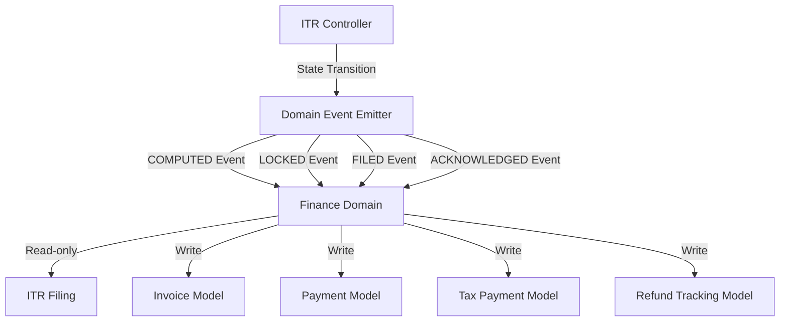

# Phase 5: Finance Module (Plug-in, Not Intrusion)

## Objective

Introduce a Finance Layer that handles billing, invoicing, payments, tax payments, and refund tracking. Finance must be **event-driven, state-aware, and optional**. It reacts to ITR lifecycle states without touching ITR logic, Domain Core, or UI filing flow.

## Core Principle (Non-Negotiable)

> **Finance reacts to ITR states. ITR never reacts to finance.**

## Architecture Overview

## Implementation Steps

### Step 5.1: Create Finance Domain + Models

**Files to Create:**

1. **`backend/src/domain/FinanceDomain.js`** (new file)

   - Pure domain logic for finance operations
   - Methods: `estimateFees()`, `generateInvoice()`, `recordPayment()`, `trackTaxPayment()`, `trackRefund()`, `reconcile()`
   - Reads ITR context (read-only)
   - Writes finance records only

2. **`backend/src/models/Payment.js`** (new file)

   - Model for service fee payments (user → platform)
   - Fields: `id`, `invoice_id`, `amount`, `method` (UPI, card, netbanking), `status`, `gateway_ref`
   - Different from `TaxPayment` (which is for tax payments to ITD)

**Files to Review:**

- `backend/src/models/Invoice.js` - Already exists, verify it has all required fields
- `backend/src/models/TaxPayment.js` - Already exists, verify it matches requirements
- `backend/src/models/RefundTracking.js` - Already exists, verify it matches requirements

### Step 5.2: Create Event System and Subscribe to Lifecycle Events

**Files to Create:**

1. **`backend/src/events/DomainEventEmitter.js`** (new file)

   - Simple event emitter for domain events
   - Events: `ITR_STATE_TRANSITION` with payload `{ filingId, fromState, toState, context }`

2. **`backend/src/events/financeEventHandlers.js`** (new file)

   - Event handlers that subscribe to ITR lifecycle events
   - Handles: `COMPUTED` → estimate fees, `LOCKED` → generate invoice, `FILED` → finalize invoice, `ACKNOWLEDGED` → track refund

**Files to Modify:**

- `backend/src/controllers/ITRController.js`
  - Emit events on state transitions:
    - `computeTax()` → emit `ITR_STATE_TRANSITION` with `toState: 'COMPUTED'`
    - `lockFiling()` → emit `ITR_STATE_TRANSITION` with `toState: 'LOCKED'`
    - `submitITR()` → emit `ITR_STATE_TRANSITION` with `toState: 'FILED'`
    - `acknowledgeFiling()` → emit `ITR_STATE_TRANSITION` with `toState: 'ACKNOWLEDGED'`

### Step 5.3: Expose Finance APIs

**Files to Create:**

1. **`backend/src/controllers/FinanceController.js`** (new file)

   - Endpoints for finance operations
   - Routes: `GET /finance/invoices/:filingId`, `POST /finance/invoices/:invoiceId/pay`, `GET /finance/payments`, etc.

2. **`backend/src/routes/finance.js`** (new file)

   - Finance routes with authentication and RBAC

**Files to Modify:**

- `backend/src/routes/index.js` - Add finance routes

### Step 5.4: Add Minimal UI Panel

**Files to Create:**

1. **`frontend/src/components/Finance/FinancePanel.js`** (new file)

   - Contextual finance panel for filing
   - Shows invoice status, payment options
   - Only visible when `allowedActions.includes('pay_invoice')` (if we add t