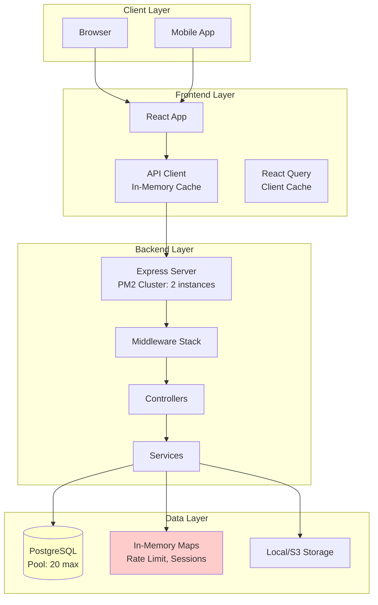

# Platform Architecture Scalability Review Plan

## Executive Summary

This plan provides a comprehensive review of the Burnblack platform architecture to identify bottlenecks and scalability issues that could impact performance under concurrent user load. The review covers database, caching, session management, rate limiting, background processing, and distributed system readiness.

## Current Architecture Analysis

### Architecture Overview



## Critical Bottlenecks Identified

### 1. In-Memory State Management (CRITICAL)

**Location**:

- `backend/src/middleware/progressiveRateLimit.js` (lines 9-11)
- `backend/src/middleware/cookieAuth.js` (session validation)
- `backend/src/services/websocket/WebSocketManager.js` (lines 10-11)
- `frontend/src/services/core/CacheService.js` (lines 8-10)
- `frontend/src/services/core/APIClient.js` (line 18)

**Issue**: All rate limiting, session tracking, WebSocket connections, and caching use in-memory Maps/Sets. This creates several problems:

1. **No Cross-Instance Sharing**: With PM2 cluster mode (2 instances), each instance maintains separate state
2. **Memory Leaks**: Maps grow unbounded without proper cleanup
3. **Session Inconsistency**: Users may be authenticated on one instance but not another
4. **Rate Limit Bypass**: Users can bypass rate limits by hitting different instances
5. **WebSocket Isolation**: Real-time updates only work within the same instance

**Impact**:

- **Severity**: CRITICAL
- **Concurrent Users**: Fails at 2+ instances
- **Memory**: Unbounded growth
- **User Experience**: Inconsistent behavior

**Recommendation**: Migrate to Redis for all shared state

### 2. Database Connection Pool Exhaustion (HIGH)

**Location**: `backend/src/config/database.js` (lines 68-73, 107-112)

**Current Configuration**:

```javascript
pool: {
  max: 20,  // Maximum connections
  min: 5,   // Minimum connections
  acquire: 30000,  // 30s timeout
  idle: 10000,     // 10s idle timeout
}
```

**Issue**:

- With 2 PM2 instances, each has 20 max connections = 40 total
- Under high load, connections may be exhausted
- Long-running queries (tax computation, OCR) hold connections
- No connection pool monitoring or alerts

**Impact**:

- **Severity**: HIGH
- **Concurrent Users**: ~100-200 before pool exhaustion
- **Symptoms**: Request timeouts, "Connection pool exhausted" errors

**Recommendation**:

- Increase pool size based on load testing
- Implement connection pool monitoring
- Use read replicas for read-heavy operations
- Implement query timeouts

### 3. Synchronous Heavy Processing (HIGH)

**Location**:

- `backend/src/services/core/TaxComputationEngine.js` (synchronous computation)
- `backend/src/routes/ocr.js` (synchronous OCR processing)
- `frontend/src/services/DocumentProcessingService.js` (client-side processing)

**Issue**: Heavy computations block request threads:

- Tax computation runs synchronously in request handler
- OCR processing blocks for 1.5-2 seconds (lines 322, 396 in ocr.js)
- Document processing happens in request lifecycle
- No background job queue

**Impact**:

- **Severity**: HIGH
- **Concurrent Users**: Request threads blocked, reducing throughput
- **Response Time**: Slow responses for heavy operations
- **Scalability**: Linear degradation with load

**Recommendation**: Implement background job queue (Bull/BullMQ with Redis)

### 4. N+1 Query Patterns (MEDIUM)

**Location**:

- `backend/src/controllers/ITRController.js` (lines 1382, 1413, 1432)
- Multiple controllers with sequential queries

**Issue**: Some queries fetch related data in loops:

```javascript
// Example pattern (needs verification)
const filings = await ITRFiling.findAll({ where: { userId } });
for (const filing of filings) {
  const draft = await ITRDraft.findOne({ where: { filingId: filing.id } });
  // N+1 query problem
}
```

**Impact**:

- **Severity**: MEDIUM
- **Database Load**: Excessive queries under load
- **Response Time**: Slower than necessary

**Recommendation**: Use eager loading with Sequelize `include`

### 5. Frontend Cache Limitations (MEDIUM)

**Location**:

- `frontend/src/services/core/CacheService.js` (max 100 items)
- `frontend/src/services/core/APIClient.js` (5-minute TTL)

**Issue**:

- Small cache size (100 items) for large application
- No cache invalidation strategy
- Cache shared across all users (potential data leakage)
- React Query cache may duplicate APIClient cache

**Impact**:

- **Severity**: MEDIUM
- **Memory**: Cache eviction under load
- **Performance**: Unnecessary API calls

**Recommendation**:

- Increase cache size or use LRU cache
- Implement proper cache invalidation
- Separate user-specific caches

### 6. WebSocket Scaling Issues (MEDIUM)

**Location**: `backend/src/services/websocket/WebSocketManager.js`

**Issue**:

- In-memory connection tracking (line 10)
- No Redis pub/sub for cross-instance messaging
- Connections tied to single instance
- No connection limit per user

**Impact**:

- **Severity**: MEDIUM
- **Real-time Features**: Don't work across instances
- **Memory**: Connection maps grow unbounded

**Recommendation**: Use Redis pub/sub for WebSocket messaging

### 7. Session Management (MEDIUM)

**Location**:

- `backend/src/app.js` (lines 54-65) - express-session with default store
- `backend/src/middleware/cookieAuth.js` - session validation

**Issue**:

- Default in-memory session store
- Sessions not shared across instances
- No session persistence strategy
- Session cleanup not configured

**Impact**:

- **Severity**: MEDIUM
- **User Experience**: Logged out when hitting different instance
- **Security**: Sessions lost on restart

**Recommendation**: Use Redis session store

### 8. File Upload Processing (LOW-MEDIUM)

**Location**:

- `backend/src/services/integration/S3Service.js`
- `frontend/src/services/documentService.js`

**Issue**:

- Synchronous file processing
- No upload queue for large files
- No progress tracking for background processing

**Impact**:

- **Severity**: LOW-MEDIUM
- **User Experience**: Long wait times for large files
- **Resource Usage**: Blocks request threads

**Recommendation**: Async file processing with job queue

## Detailed Findings by Component

### Database Layer

**Current State**:

- PostgreSQL with Sequelize ORM
- Connection pool: max 20, min 5
- Query logging for slow queries (>100ms)
- Some indexes exist (from migration script)

**Issues**:

1. Pool size may be insufficient for 2+ instances
2. No read replica configuration
3. No query result caching
4. Some missing indexes (needs audit)

**Files to Review**:

- `backend/src/config/database.js`
- `backend/src/scripts/migrations/optimize-database-indexes.js`
- All controller files for N+1 patterns

### Caching Layer

**Current State**:

- Frontend: In-memory Map (100 items max)
- Backend: No centralized caching
- React Query: Client-side caching (5 min stale time)

**Issues**:

1. No distributed cache (Redis)
2. Cache size limitations
3. No cache invalidation strategy
4. Duplicate caching (APIClient + React Query)

**Files to Review**:

- `frontend/src/services/core/CacheService.js`
- `frontend/src/services/core/APIClient.js`
- `frontend/src/store/index.js` (React Query config)

### Rate Limiting

**Current State**:

- Progressive rate limiting (in-memory Map)
- Standard rate limit: 100 req/15min
- Strict rate limit: 5 req/15min

**Issues**:

1. In-memory storage (doesn't work across instances)
2. No Redis backend
3. Rate limit state lost on restart

**Files to Review**:

- `backend/src/middleware/progressiveRateLimit.js`

### Background Processing

**Current State**:

- No job queue system
- All processing synchronous
- Tax computation in request handler
- OCR processing blocks requests

**Issues**:

1. No async job processing
2. Request threads blocked
3. No retry mechanism for failed jobs
4. No job priority system

**Files to Review**:

- `backend/src/services/core/TaxComputationEngine.js`
- `backend/src/routes/ocr.js`
- All controllers with heavy processing

### WebSocket Management

**Current State**:

- In-memory connection tracking
- Per-user connection sets
- Admin connection tracking

**Issues**:

1. Doesn't work across instances
2. No Redis pub/sub
3. Connection state lost on restart

**Files to Review**:

- `backend/src/services/websocket/WebSocketManager.js`

## Recommendations Priority Matrix

### Critical (Implement First)

1. **Redis Integration for Shared State**

   - Rate limiting
   - Session storage
   - WebSocket pub/sub
   - Cache layer

2. **Database Connection Pool Optimization**

   - Increase pool size
   - Add monitoring
   - Implement read replicas

3. **Background Job Queue**

   - Bull/BullMQ with Redis
   - Move heavy processing to jobs
   - Implement job priorities

### High Priority

4. **Fix N+1 Query Patterns**

   - Audit all controllers
   - Implement eager loading
   - Add query monitoring

5. **Distributed Caching**

   - Redis cache layer
   - Cache invalidation strategy
   - Cache warming for hot data

6. **WebSocket Scaling**

   - Redis pub/sub
   - Cross-instance messaging
   - Connection limits

### Medium Priority

7. **Frontend Cache Optimization**

   - Increase cache size
   - Implement LRU eviction
   - User-specific cache keys

8. **File Upload Optimization**

   - Async processing
   - Upload queue
   - Progress tracking

9. **Database Index Audit**

   - Review all queries
   - Add missing indexes
   - Monitor slow queries

### Low Priority

10. **Monitoring and Observability**

    - APM integration
    - Performance metrics
    - Alerting system

## Implementation Roadmap

### Phase 1: Foundation (Week 1-2)

- Install and configure Redis
- Migrate rate limiting to Redis
- Migrate session storage to Redis
- Add Redis connection pooling

### Phase 2: Background Processing (Week 3-4)

- Install Bull/BullMQ
- Create job queue infrastructure
- Migrate tax computation to jobs
- Migrate OCR processing to jobs

### Phase 3: Caching (Week 5-6)

- Implement Redis cache layer
- Add cache invalidation
- Optimize frontend caching
- Cache warming strategy

### Phase 4: Database Optimization (Week 7-8)

- Increase connection pool
- Fix N+1 queries
- Add missing indexes
- Implement read replicas

### Phase 5: WebSocket Scaling (Week 9-10)

- Redis pub/sub for WebSocket
- Cross-instance messaging
- Connection management

## Success Metrics

- **Concurrent Users**: Support 1000+ concurrent users
- **Response Time**: <200ms for 95th percentile
- **Database Connections**: <80% pool utilization
- **Cache Hit Rate**: >70% for cached endpoints
- **Job Processing**: <5s queue time for priority jobs
- **Error Rate**: <0.1% under load

## Files Requiring Changes

### Backend

- `backend/src/config/database.js` - Pool configuration
- `backend/src/middleware/progressiveRateLimit.js` - Redis backend
- `backend/src/app.js` - Redis session store
- `backend/src/services/websocket/WebSocketManager.js` - Redis pub/sub
- All controllers - N+1 query fixes
- New: `backend/src/services/core/RedisService.js`
- New: `backend/src/services/core/JobQueue.js`

### Frontend

- `frontend/src/services/core/CacheService.js` - Cache optimization
- `frontend/src/services/core/APIClient.js` - Cache strategy
- `frontend/src/store/index.js` - React Query optimization

### Infrastructure

- `ecosystem.config.js` - PM2 configuration
- New: `docker-compose.yml` - Redis service
- New: `.env.production` - Redis configuration

## Testing Strategy

1. **Load Testing**: Simulate 1000+ concurrent users
2. **Stress Testing**: Test connection pool limits
3. **Chaos Testing**: Test instance failures
4. **Performance Testing**: Measure before/after metrics

## Risk Assessment

**Low Risk**:

- Redis integration (proven technology)
- Database pool increase (configuration change)
- Cache optimization (non-breaking)

**Medium Risk**:

- Background job migration (requires testing)
- WebSocket pub/sub (real-time feature)

**High Risk**:

- Session migration (user impact)
- N+1 query fixes (requires careful testing)

## Conclusion

The platform has several critical bottlenecks that will prevent scaling beyond a single instance. The primary issues are in-memory state management and synchronous heavy processing. Implementing Redis for shared state and a background job queue wil