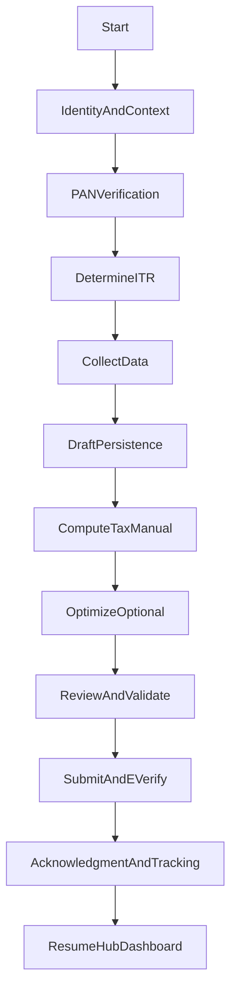

# ITR Userflow Core Spec (Draft → Compute → Review → File)

This document defines the **canonical, minimum viable** ITR journey that every persona (END_USER + CA) and every ITR type (1/2/3/4) must pass through. It also maps each step to the **current Burnblack routes/components** so we can refine flows step-by-step without breaking the product.

## Why “core-first” (scale logic)
- **One canonical artifact**: every journey is anchored around `filingId` + latest `draftId` (resume anytime).
- **Progressive disclosure**: only collect what’s required for the chosen ITR path; everything else is deferred or optional.
- **Replace “pages” with “states”**: the journey is a sequence of states; UI can be a wizard, tabs, or a single screen.

---

## Personas (supported by the same core)

### END_USER (self-serve)
- Primary goal: finish a return with minimal overwhelm.
- Core need: “one next action” at all times.

### CA-assisted (firm / staff)
- Primary goal: move many clients through the same core steps with review/approval gates.
- Core need: client context switching + review queue + auditability.

---

## Canonical state machine (invariant steps)

### Step contracts (definition of “done”)

- **IdentityAndContext**: we know *who* we’re filing for (self/family OR client).
- **PANVerification**: PAN is verified OR user explicitly decides to proceed in a limited mode (future).
- **DetermineITR**: a selected `itrType` exists and is explainable (“why this ITR”).
- **CollectData**: the user has a chosen collection mode (prefill/import/manual). Never block.
- **DraftPersistence**: we have a stable `filingId` and `draftId` and can resume.
- **ComputeTaxManual**: compute runs only on explicit user action; results are stable and traceable.
- **OptimizeOptional**: recommendations are additive; never block submission.
- **ReviewAndValidate**: “must fix” vs “recommended”; submission is gated only by “must fix”.
- **SubmitAndEVerify**: single decision point for verification method → submit.
- **AcknowledgmentAndTracking**: show ack, next steps, and tracking entry points.
- **ResumeHubDashboard**: dashboard shows one primary CTA: Start / Continue / Track.

---

## Current mapping (routes, components, APIs)

### 1) Identity & context
- **END_USER route**: `/itr/start` → `/itr/select-person`
  - UI: `[frontend/src/pages/ITR/StartFiling.js](frontend/src/pages/ITR/StartFiling.js)` (redirect)
  - UI: `[frontend/src/components/ITR/FilingPersonSelector.js](frontend/src/components/ITR/FilingPersonSelector.js)`
- **CA routes (firm/staff)**:
  - Firm dashboard: `/firm/dashboard` or `/firm/:firmId/dashboard`
  - Client list: `/firm/:firmId/clients` (`[frontend/src/pages/Firm/ClientList.js](frontend/src/pages/Firm/ClientList.js)`)
  - Client onboarding: `/firm/:firmId/clients/new` (`[frontend/src/pages/Firm/ClientOnboardingForm.js](frontend/src/pages/Firm/ClientOnboardingForm.js)`)
  - Staff dashboard: `/ca/clients` (`[frontend/src/pages/Dashboard/CAStaffDashboard.js](frontend/src/pages/Dashboard/CAStaffDashboard.js)`)

**Gap (core)**: CA flows don’t yet have a single “Open client filing” route that lands in computation with a firm/client context; this will be handled in the flow audit backlog.

### 2) PAN verification
- **Route**: `/itr/pan-verification`
- **UI**: `[frontend/src/pages/ITR/PANVerification.js](frontend/src/pages/ITR/PANVerification.js)`
- **API**:
  - `GET /api/itr/pan/status/:pan` (status check, used via `apiClient.get('/itr/pan/status/...')`)
  - `POST /api/itr/pan/verify` (SurePass verification)

### 3) Determine ITR (multiple currently)
Current platform offers **multiple determination paths** (these should converge to one canonical path later):

- **Guided mode**: `/itr/income-sources`
  - UI: `[frontend/src/pages/ITR/IncomeSourceSelector.js](frontend/src/pages/ITR/IncomeSourceSelector.js)`
- **Questionnaire mode**: `/itr/select-form`
  - UI: `[frontend/src/pages/ITR/ITRFormSelection.js](frontend/src/pages/ITR/ITRFormSelection.js)`
- **Recommender**: `/itr/recommend-form`
  - UI: `[frontend/src/components/ITR/ITRFormRecommender.js](frontend/src/components/ITR/ITRFormRecommender.js)`
  - API: `POST /api/itr/recommend-form` (optional, used for validation/merge)
- **Expert mode**: `/itr/direct-selection`
  - UI: `[frontend/src/pages/ITR/ITRDirectSelection.js](frontend/src/pages/ITR/ITRDirectSelection.js)`

### 4) Collect data (prefill/import/manual)
- **Route**: `/itr/data-source`
  - UI: `[frontend/src/components/ITR/DataSourceSelector.js](frontend/src/components/ITR/DataSourceSelector.js)`
- **Route**: `/itr/document-upload`
  - UI: `[frontend/src/pages/ITR/DocumentUploadHub.js](frontend/src/pages/ITR/DocumentUploadHub.js)`

### 5) Draft persistence + resume
- **Computation route(s)**:
  - `/itr/computation` (primary)
  - `/itr/filing/:filingId/*` (alternative entry; currently renders the same computation UI)
- **UI**: `[frontend/src/pages/ITR/ITRComputation.js](frontend/src/pages/ITR/ITRComputation.js)`
- **Backend draft endpoints (canonical)**: `[backend/src/routes/itr.js](backend/src/routes/itr.js)`
  - `POST /api/itr/drafts` (create filing+draft)
  - `PUT /api/itr/drafts/:draftId` (update draft)
  - `GET /api/itr/drafts/:draftId` (fetch draft)
- **Resume hub**:
  - END_USER: `/dashboard` (`[frontend/src/pages/Dashboard/UserDashboard.js](frontend/src/pages/Dashboard/UserDashboard.js)`)
  - All roles: `/home` role redirect (`[frontend/src/pages/HomeRedirect.js](frontend/src/pages/HomeRedirect.js)`)

### 6) Compute tax (manual)
- Frontend compute trigger lives in `[frontend/src/pages/ITR/ITRComputation.js](frontend/src/pages/ITR/ITRComputation.js)`
- API (current):
  - `POST /api/itr/compute-tax` (regime comparison compute)
  - `POST /api/itr/drafts/:draftId/compute` (draft compute, available as route)

### 7) Optimize (optional)
- Current: recommendations exist and can be generated in computation, but must remain non-blocking.

### 8) Review & validate
Current state:
- Validation exists at section-level inside computation.
Target state:
- A single review checklist step (must-fix vs recommended) becomes the submission gate.

### 9) Submit + e-verify
Current state:
- E-verify modal exists inside computation (`EVerificationModal` used by `ITRComputation`).
Gap:
- “Submit” needs to become a single state transition to acknowledgment + tracking.

### 10) Acknowledgment + tracking
- Acknowledgment page exists:
  - UI: `[frontend/src/pages/Acknowledgment.js](frontend/src/pages/Acknowledgment.js)`
- Refund tracking exists:
  - UI: `[frontend/src/pages/ITR/RefundTracking.js](frontend/src/pages/ITR/RefundTracking.js)`

---

## What is canonical *today* (minimum friction)

To reduce confusion and ship improvements safely, treat this as the **canonical END_USER path**:

1. `/home` → `/dashboard`\n2. `/itr/start` → `/itr/select-person`\n3. `/itr/pan-verification` (if needed)\n4. `/itr/recommend-form` (or guided equivalents)\n5. `/itr/computation`\n6. Review/submit (to be consolidated)\n7. `/acknowledgment/:filingId`\n8. `/dashboard` resume + track

CA users follow the same core after selecting a client context; the CA-specific difference is the presence of a review queue (`/firm/:firmId/review-queue`) and assignment workflows.

