# Business Logic Sequence Diagrams

## Expert Review Flagging Process

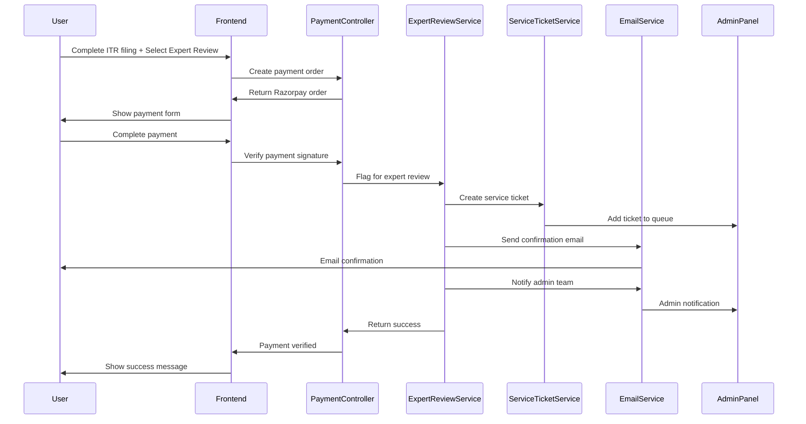

## Automated Invoice Generation and Delivery Process

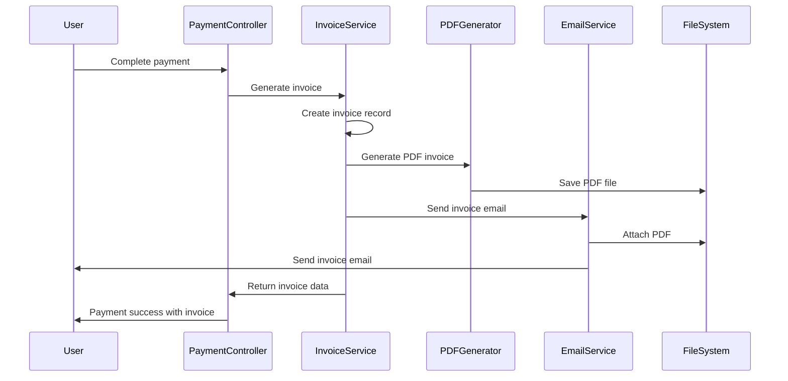

## CA Firm Subscription Process

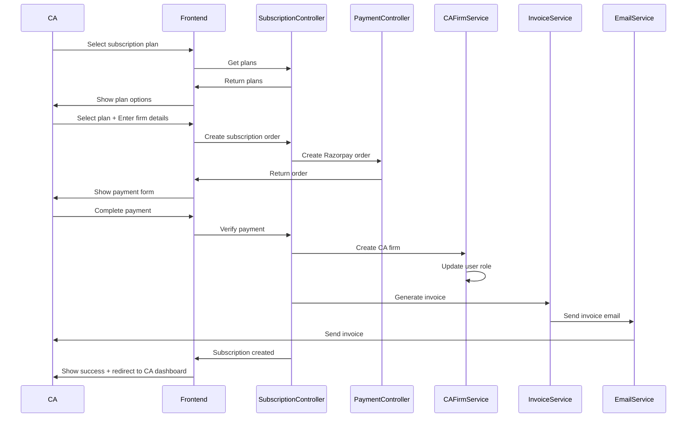

## Payment Verification and Processing Flow

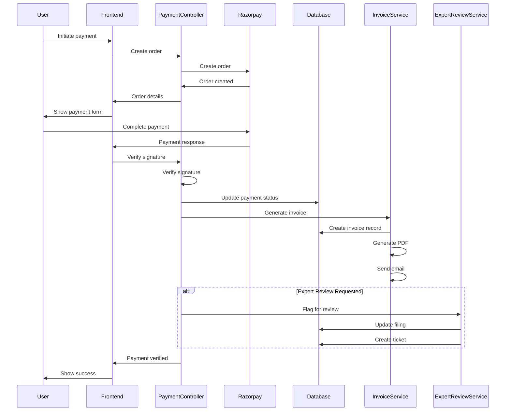

## Invoice Generation and Email Delivery

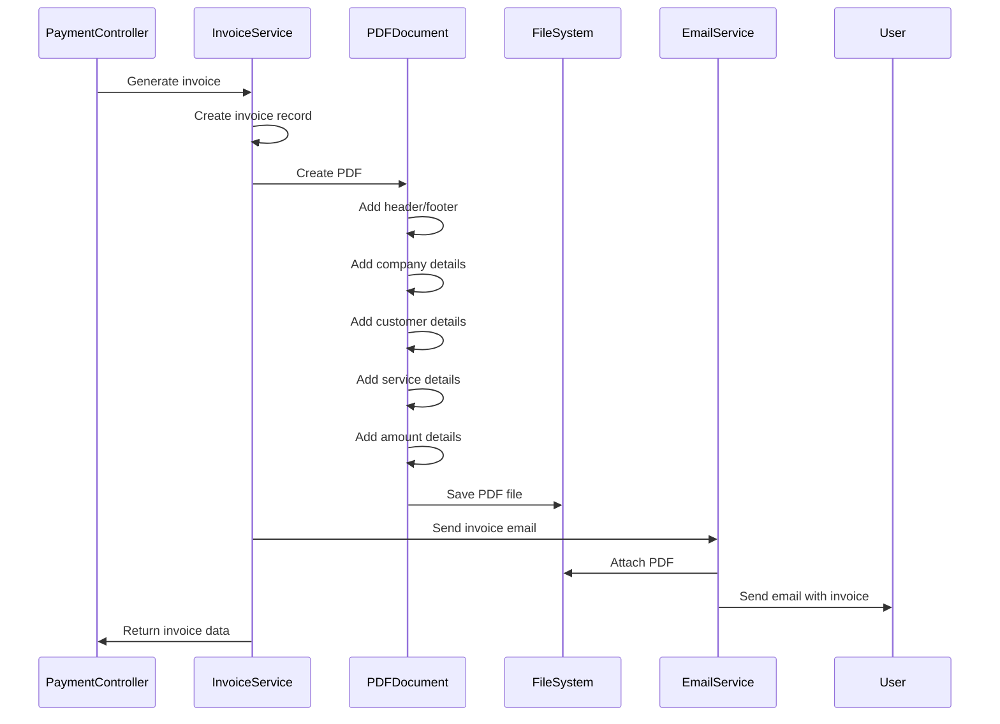

## Service Ticket Creation for Expert Review

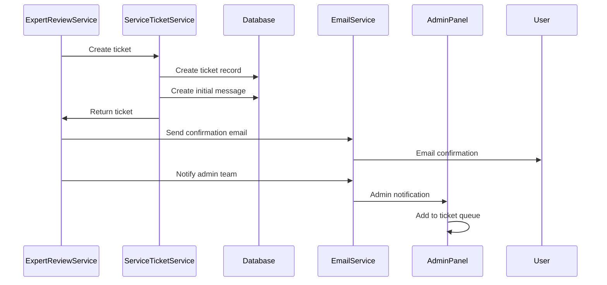

## CA Firm Creation and Role Update

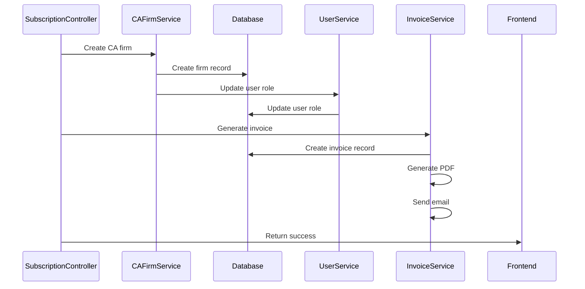

## Payment Gateway Integration Flow

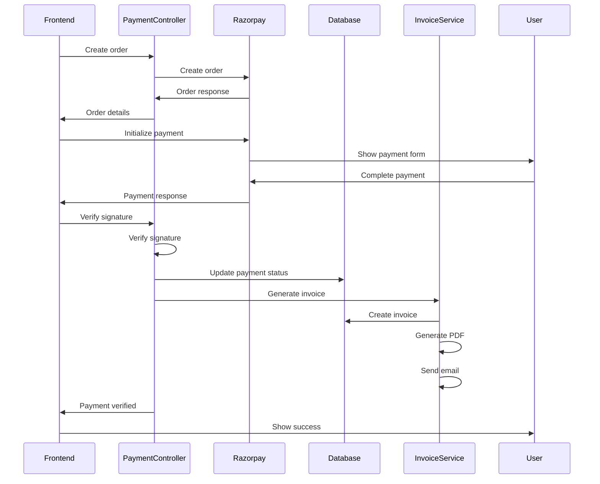

## Expert Review Queue Management

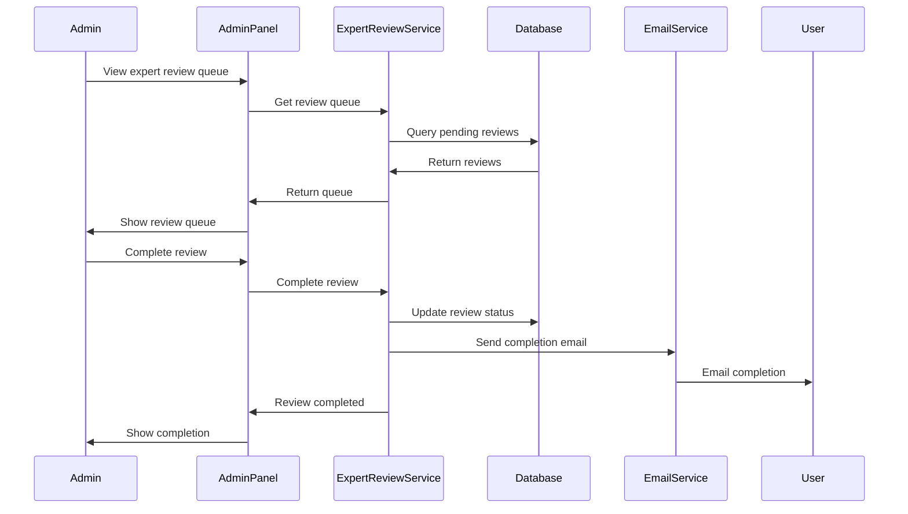

## Invoice Management and Resend

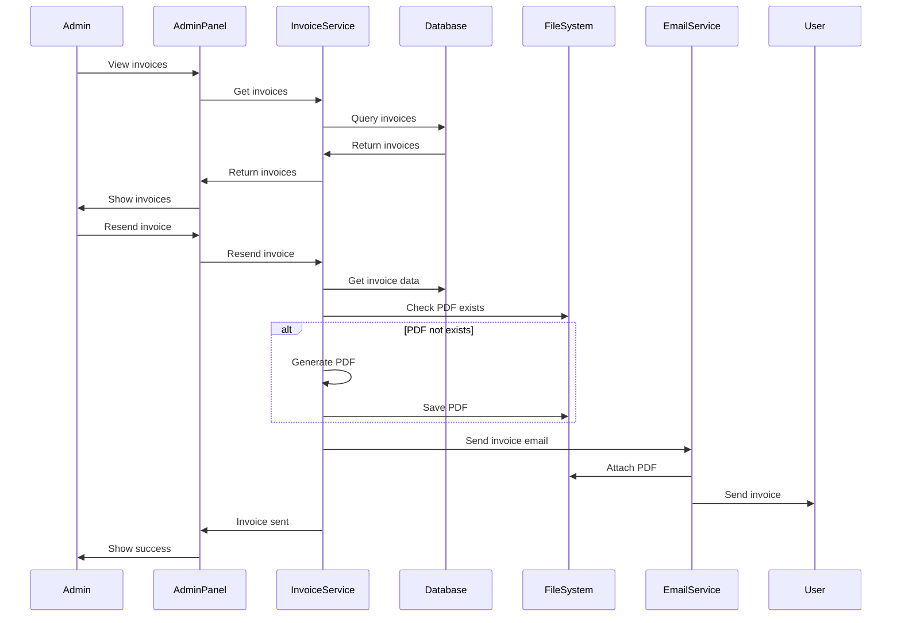

## Subscription Plan Management

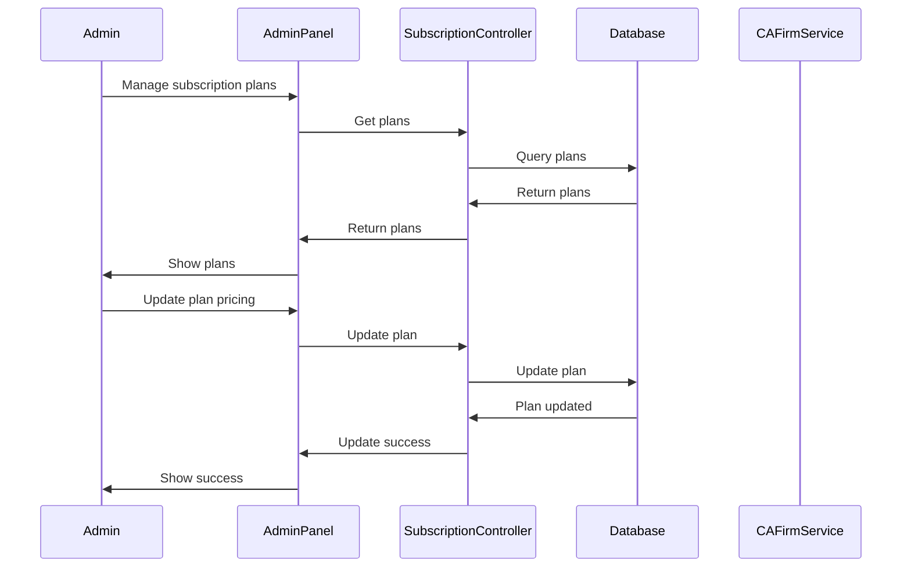

## Payment Status Tracking

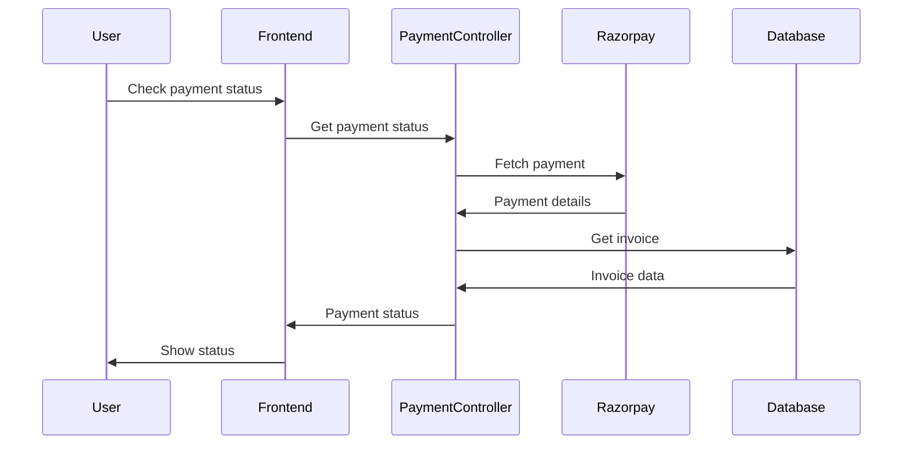

## Error Handling and Rollback

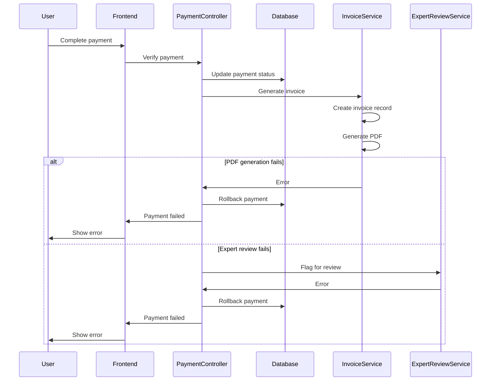

## Success Flow - Complete Payment Processing

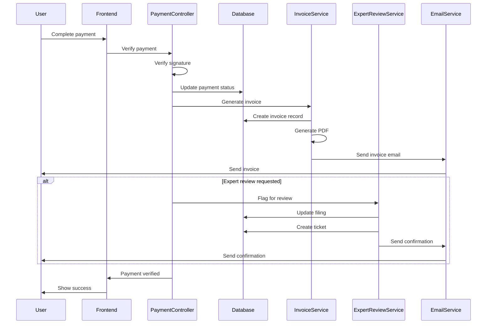

## API Endpoints Summary

### Payment Endpoints
- `POST /api/payments/create-order` - Create payment order
- `POST /api/payments/verify-signature` - Verify payment signature
- `GET /api/payments/status/:paymentId` - Get payment status
- `GET /api/payments/history` - Get payment history

### Subscription Endpoints
- `GET /api/subscriptions/plans` - Get subscription plans
- `GET /api/subscriptions/plans/:planId` - Get plan by ID
- `POST /api/subscriptions/create-order` - Create subscription order
- `POST /api/subscriptions/verify-signature` - Verify subscription payment
- `GET /api/subscriptions/status` - Get subscription status
- `GET /api/subscriptions/history` - Get subscription history
- `POST /api/subscriptions/cancel` - Cancel subscription
- `POST /api/subscriptions/upgrade` - Upgrade subscription

### Expert Review Endpoints
- `POST /api/expert-review/flag` - Flag filing for expert review
- `GET /api/expert-review/status/:filingId` - Get expert review status
- `POST /api/expert-review/complete` - Complete expert review
- `GET /api/expert-review/queue` - Get expert review queue

### Invoice Endpoints
- `GET /api/invoices/:invoiceId` - Get invoice by ID
- `GET /api/invoices/user/:userId` - Get user invoices
- `POST /api/invoices/:invoiceId/resend` - Resend invoice email
- `GET /api/invoices/:invoiceId/download` - Download invoice PDF

## Business Logic Flow Summary

1. **End User Payment Flow**
   - User completes ITR filing
   - Selects expert review (optional)
   - Makes payment through Razorpay
   - System verifies payment
   - Generates and sends invoice
   - Flags for expert review if requested
   - Creates service ticket for review

2. **CA Firm Subscription Flow**
   - CA selects subscription plan
   - Enters firm details
   - Makes payment through Razorpay
   - System verifies payment
   - Creates CA firm record
   - Updates user role
   - Generates and sends invoice

3. **Expert Review Process**
   - Filing flagged for review
   - Service ticket created
   - Admin team notified
   - Expert completes review
   - User notified of completion
   - Filing status updated

4. **Invoice Generation**
   - Payment verified
   - Invoice record created
   - PDF generated
   - Email sent with PDF
   - Invoice stored for future access

## Error Handling

- Payment verification failures
- PDF generation errors
- Email delivery failures
- Database transaction rollbacks
- Service ticket creation errors
- Expert review processing errors

## Security Considerations

- Payment signature verification
- Secure PDF generation
- Encrypted email delivery
- Database transaction integrity
- Admin access controls
- Audit logging
